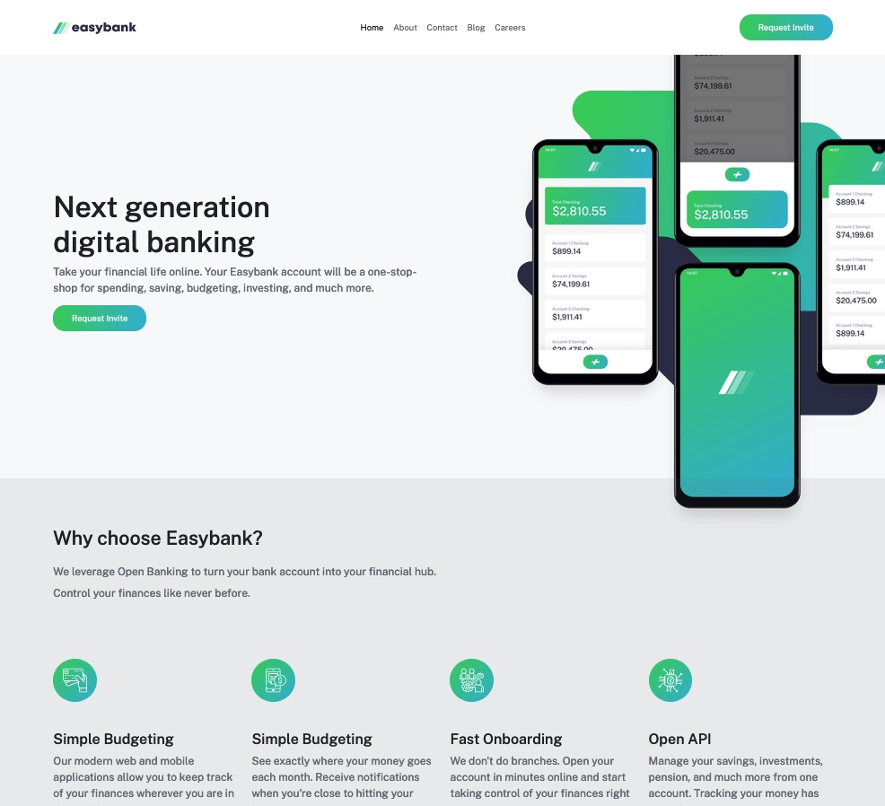

# Frontend Mentor - Easy Bank website solution

This is a solution to the [Designo agency website challenge on Frontend Mentor](https://www.frontendmentor.io/challenges/easybank-landing-page-WaUhkoDN/hub). Frontend Mentor challenges help you improve your coding skills by building realistic projects.

## Table of contents

- [Overview](#overview)
  - [The challenge](#the-challenge)
  - [Screenshot](#screenshot)
  - [Links](#links)
- [My process](#my-process)
  - [Built with](#built-with)
  - [What I learned](#what-i-learned)
- [Author](#author)

**Note: Delete this note and update the table of contents based on what sections you keep.**

## Overview

### The challenge

Users should be able to:

- View the optimal layout for the site depending on their device's screen size
- See hover states for all interactive elements on the page

### Screenshot

### Links

- Solution URL: (https://bank-bs5.vercel.app/)

## My process

- Started with getting all of the fonts, colors, and buttons configured into the sass files
- Made nav and footer components
- Made sure the nav, main, and footers behaved like I wanted them to together
- Went page by page and made everything as simple as I could

### Built with

- Semantic HTML5 markup
- SCSS
- Bootstrap 5.3
- React + Vite
- Mobile-first workflow

### What I learned

- Not a ton honestly, this was just for fun
- I did learn a bit with background images since I havne't had to mess with those much

## Author

- Frontend Mentor - [@rmartin93](https://www.frontendmentor.io/profile/@rmartin93)
